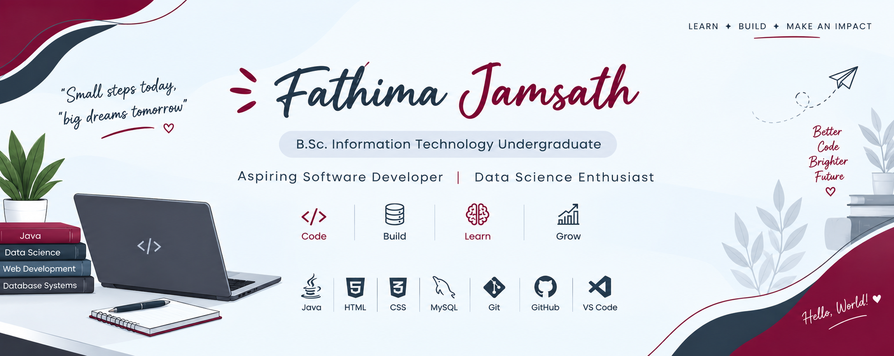

  

# Hi, I'm Fathima Jamsath 👋

🎓 B.Sc. Information Technology Undergraduate at The Open University of Sri Lanka

💻 Passionate about Software Development, Databases, and Technology

---

## 🚀 Technologies & Tools

- Java
- MySQL
- HTML
- CSS
- Git & GitHub
- JDBC
- IntelliJ IDEA
- VS Code

---

## 🌱 Currently Learning

- Software Engineering
- Database Systems
- Java Programming
- Web Development

---

## 📌 Featured Project

### 💊 Pharmacy Inventory System

A desktop-based Pharmacy Inventory Management System developed using Java Swing, MySQL, and JDBC.

**Features**
- Medicine Management
- Supplier Management
- Stock Management
- Billing System

---

## 📫 Connect With Me

- GitHub: github.com/FathimJamsath
- LinkedIn: (https://www.linkedin.com/in/fathima-jamsath-7280a3397/)

---

⭐ Always learning and building new projects.
